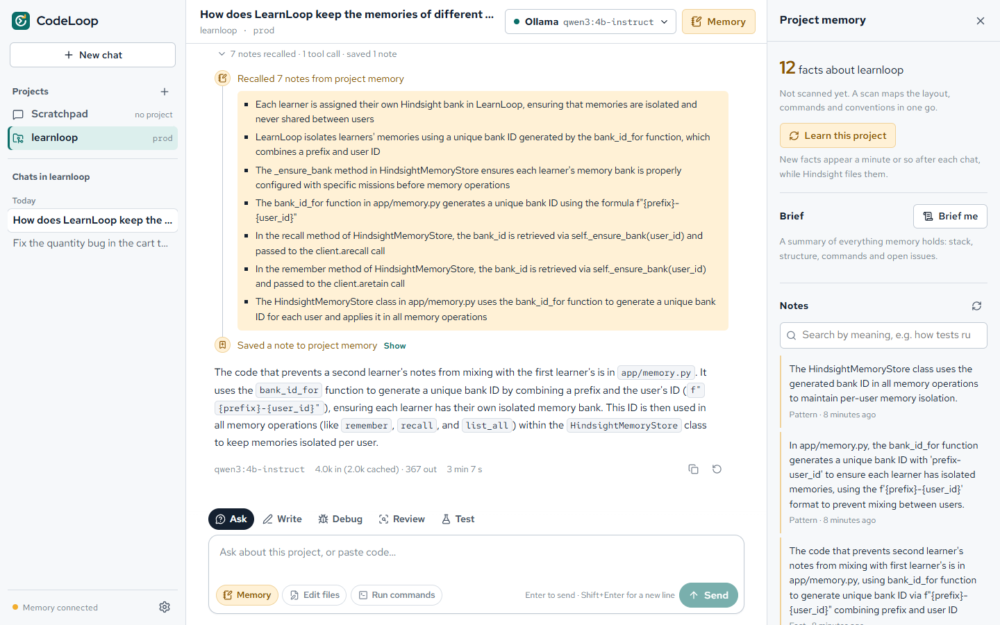
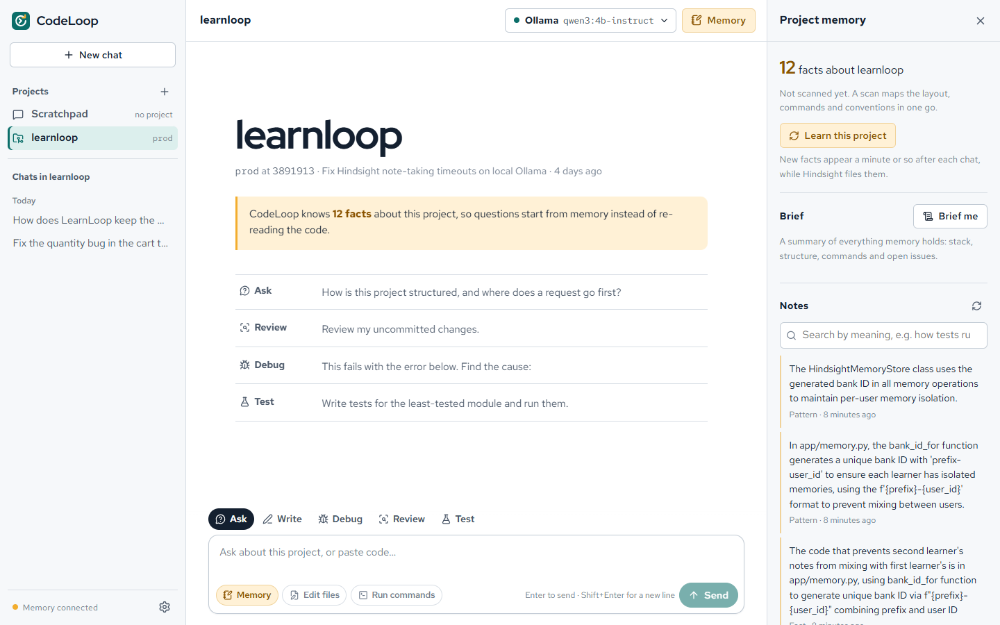
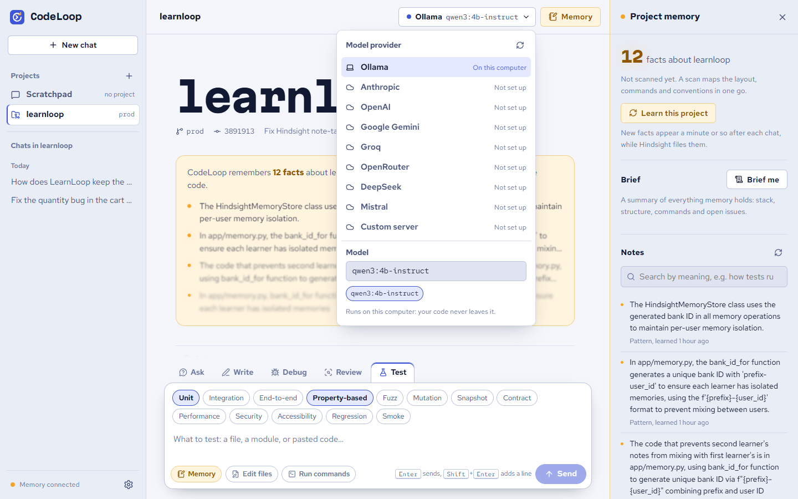
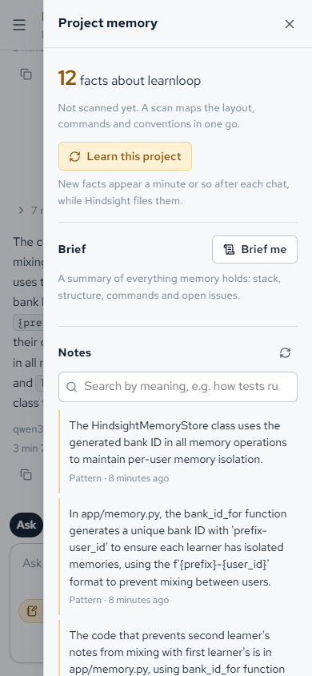
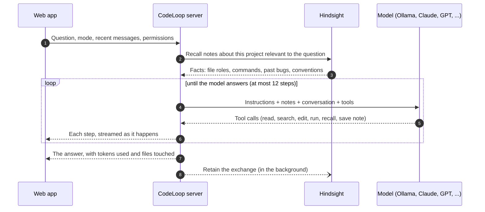

<p align="center">
  
</p>

<h1 align="center">CodeLoop</h1>

<p align="center">
  <strong>A coding agent that remembers your codebase.</strong><br />
  It writes, debugs, reviews and tests code in your projects, and keeps long-term notes on each one,<br />
  so it stops re-reading the same files every time you ask a question.
</p>

<p align="center">
  
  
  
  
  
</p>



## Why memory matters for a coding agent

A coding agent without memory starts every chat blind. To answer "how do I run the tests?" it lists folders,
opens the README, reads `package.json`, greps for `pytest`... and next week it does all of that again. That
exploration is most of what an agent spends its tokens on.

CodeLoop keeps a memory bank per project in [Hindsight](https://github.com/vectorize-io/hindsight). Every
answer starts by recalling what it already knows, which file owns what, which commands work, which bugs were
fixed and why. It only reads code it hasn't seen or is about to change. What it learns is filed back into
memory after each answer.

```
Monday:   "Why does checkout return 500?"   →  reads 6 files, finds a missing None check, saves a note
Friday:   "Add a discount code to checkout" →  recalls where checkout lives and how its tests run,
                                               reads only the 2 files it changes
```

Measured on a real repository with a local 4B model (`qwen3:4b-instruct` on an 8 GB laptop), asking about
the same code twice in different words:

| | First question | Second question, a few minutes later |
|---|---|---|
| Notes recalled from memory | 0 | 7 |
| Files read | 1 | 0 |
| Input tokens | 6,791 | 4,000 |

One pair of questions is an anecdote, not a benchmark; `python -m scripts.eval_memory <project>` measures it
across a set of questions with memory on and off.

## Features

**Five ways to work**, chosen per message:

| Mode | What the agent does |
|---|---|
| Ask | Answers questions about the code, grounded in the files it reads |
| Write | Implements changes in the project's own style, then runs the relevant tests |
| Debug | Finds the root cause first (reproducing it when it can run commands), then makes the smallest fix |
| Review | Reviews a file, pasted code or your uncommitted changes; findings ranked by severity with `path:line` |
| Test | Writes and runs tests by any of 13 methods: unit, integration, end-to-end, property-based, fuzz, mutation, snapshot, contract, performance, security, accessibility, regression and smoke |

**Memory you can see.** Every answer shows a timeline of what the agent did: notes recalled from memory
(in amber), files read, searches, commands run with their output, and each edit as a diff. The memory panel
shows how many facts it holds about the project, a project brief written from memory, a searchable list of
notes, and a button to forget everything.

**Learn a project in one scan.** "Learn this project" reads the layout, manifests, build and CI files and
recent commits, and hands them to Hindsight to turn into facts. It costs no agent tokens and works with the
smallest local model. CodeLoop notices when the code has moved on since the last scan.

**Any model, including local ones.**

| Provider | How | Notes |
|---|---|---|
| Ollama | Local, no key | The default. Free and private: your code never leaves your machine |
| Anthropic | `ANTHROPIC_API_KEY` | Native Messages API with prompt caching and automatic refusal fallback |
| OpenAI | `OPENAI_API_KEY` | |
| Google Gemini, Groq, OpenRouter, DeepSeek, Mistral | Their API key | Through their OpenAI-compatible endpoints |
| Anything else OpenAI-compatible | `CODELOOP_CUSTOM_BASE_URL` | LM Studio, vLLM, llama.cpp, Together, ... |

Switch provider and model from the picker in the top bar at any time. Small local models that can't call
tools still work: CodeLoop notices and answers from memory and what you paste.

**You decide what it may touch.** Reading is always allowed inside a project. Editing files and running
commands are switches in the message box, off by default, set per chat.

## Screenshots

| A project and what memory knows about it | Every provider in one picker; testing methods |
|---|---|
|  |  |

<p align="center"></p>

## How it works

Every question runs the same loop: **recall, then think and act, then answer, then retain.**



The browser receives the agent's steps as a stream of JSON lines, so you watch it work instead of staring
at a spinner.

## Safety

An agent that reads, edits and runs code on your machine needs hard limits, enforced in code rather than by
asking the model nicely:

- **The project folder is a wall.** Every path is resolved (symlinks included) and must stay inside the project.
- **Secrets stay put.** `.env` files, private keys and credential files are never read, searched, snapshotted
  or edited. Their contents would otherwise be sent to the model provider.
- **Tools follow permissions.** A tool the chat didn't allow is never given to the model, so it can't be called.
- **Commands are constrained.** One program at a time, no shell (so no pipes, `&&` or redirects), only programs
  on an allowlist, only read-only `git` subcommands, a timeout, and none of the server's API keys in the
  command's environment.
- **Local only.** Docker publishes every port on `127.0.0.1`. The server rejects requests whose `Host` isn't
  local (blocking DNS rebinding) and state-changing requests sent from other websites.
- **Prompt injection.** Memory notes are escaped and fenced in prompts, and the agent is told that file
  contents, command output and notes are data, never instructions.

Running tests still runs code from the project, so only allow commands for projects you trust.

## Quick start

You need [Docker Desktop](https://www.docker.com/products/docker-desktop/), Python 3.11+, Node 22+, and
[Ollama](https://ollama.com) (or an API key for a hosted model).

```bash
ollama pull qwen3:4b-instruct
cp .env.example .env                  # set CODELOOP_WORKSPACE_ROOT to the folder holding your repos
docker compose up -d hindsight        # long-term memory, on 127.0.0.1:8888

cd frontend && npm install && npm run build && cd ..     # builds the web app into backend/app/static

cd backend
python -m venv .venv && .venv/Scripts/activate           # macOS/Linux: source .venv/bin/activate
pip install -r requirements.txt
uvicorn app.main:app
```

Open **http://localhost:8000**, pick a project in the sidebar (or clone one), and press **Learn this project**.

Running the server on your machine (rather than in Docker) lets the agent run your projects' tests with your
own toolchain. To run everything in Docker instead, set `CODELOOP_HOST_WORKSPACE` in `.env` and run
`docker compose up --build`; commands then only have Python and git available.

### Development

Run the backend and the frontend in two terminals:

```bash
# backend/
uvicorn app.main:app --reload                 # API on :8000
pytest -q && ruff check .                     # tests and lint
python -m scripts.eval_memory <project-id>    # measure memory's effect on tool calls and tokens

# frontend/
npm run dev                                   # web app with live reload on :5173, calling the API on :8000
npm test && npm run lint && npm run typecheck
```

## Project structure

```
backend/                Python server (FastAPI): the agent, its tools, memory and model providers
  app/                  the server's code; app/static is where the frontend build lands
  tests/                server tests, run with pytest from backend/
  scripts/              eval_memory.py: measures what memory saves
frontend/               React web app (Vite + TypeScript); tests sit next to the code in src/
docs/images/            screenshots for this README
workspace/              your projects: each folder in here is a repository the agent can open
docker-compose.yml      Hindsight (and optionally the app) in Docker
Dockerfile              one image: builds the frontend, then serves it with the backend
.env.example            every setting, with comments; copy it to .env
```

## Architecture

| Layer | Files (in `backend/app/`) | Role |
|---|---|---|
| HTTP | `main.py`, `schemas.py` | Routes, validation, NDJSON streaming, host and origin checks |
| Agent | `agent.py`, `prompts.py` | The recall → act → answer → retain loop, modes, testing methods |
| Tools | `tools.py` | Tool definitions, per-chat permissions, what each step shows you |
| Workspace | `workspace.py`, `snapshot.py` | Path sandbox, secret blocking, commands, git, the one-scan snapshot |
| Memory | `memory.py` | Hindsight behind a small interface; one bank per project |
| Models | `llm/` | One interface; an OpenAI-compatible adapter and a native Anthropic adapter |
| Settings | `config.py` | Every setting, read from `.env` at the repository root |

The web app lives in `frontend/src/`: `components/` for the UI, `lib/` for state, the API client and the
stream reader, and `hooks/` for small shared behaviours.

The agent only talks to interfaces (`MemoryStore`, `LLM`), so tests swap in fakes: the server's tests
and the web app's tests run in seconds with no network, no keys and no model.

## Limitations

- **No accounts.** CodeLoop is a local tool for one developer; don't expose it to a network.
- **Chats live in one browser.** They're saved in local storage and don't sync between devices.
- **Answers arrive whole.** Steps stream live, but the final answer appears when it's complete.
- **One local model does two jobs.** With Ollama for both the agent and Hindsight's note-taking, the agent
  waits while Hindsight files a chat or a scan; on an 8 GB laptop a scan can take 20 minutes or more. Give
  Hindsight a smaller or hosted model (see `.env.example`) to keep the agent responsive.
- **Ollama's context size.** Ollama picks a model's context size itself (16k tokens for `qwen3:4b-instruct`
  on a 4 GB GPU). If yours picks 4k or less, set `OLLAMA_CONTEXT_LENGTH=16384` for Ollama: with less, long
  prompts lose their beginning, including the agent's instructions.
- **Memory can lag the code.** Notes are dated and the agent re-reads files before changing them; scan the
  project again after big changes.

## License

MIT
